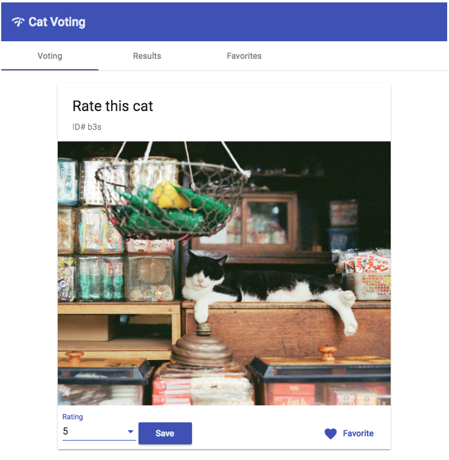

# CatVoting

How to run.

1. Get an API key from TheCatAPI.com.
 
2. Set your API key as an environment variable.  See .env.sample as an example of how to do this.

```
export APIKEY=<apikey>
```

3. Install the required libraries.

```
npm install
```

Run the angular app and server
```
#angular
npm start

#node
npm run server
```

Happy cat voting!

